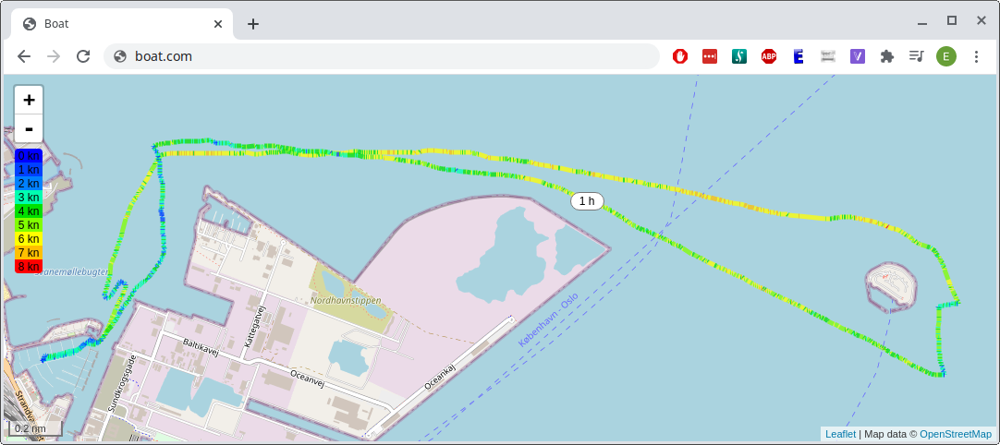
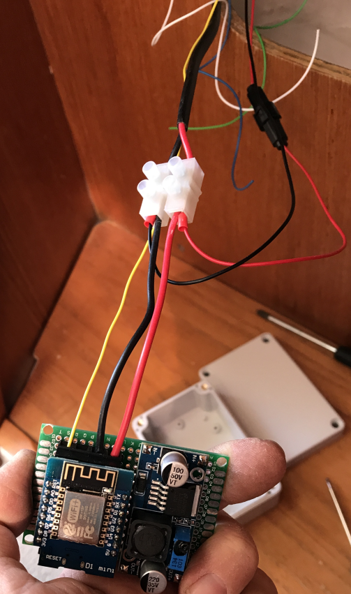
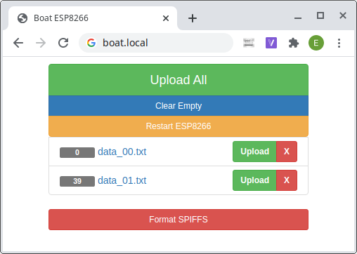
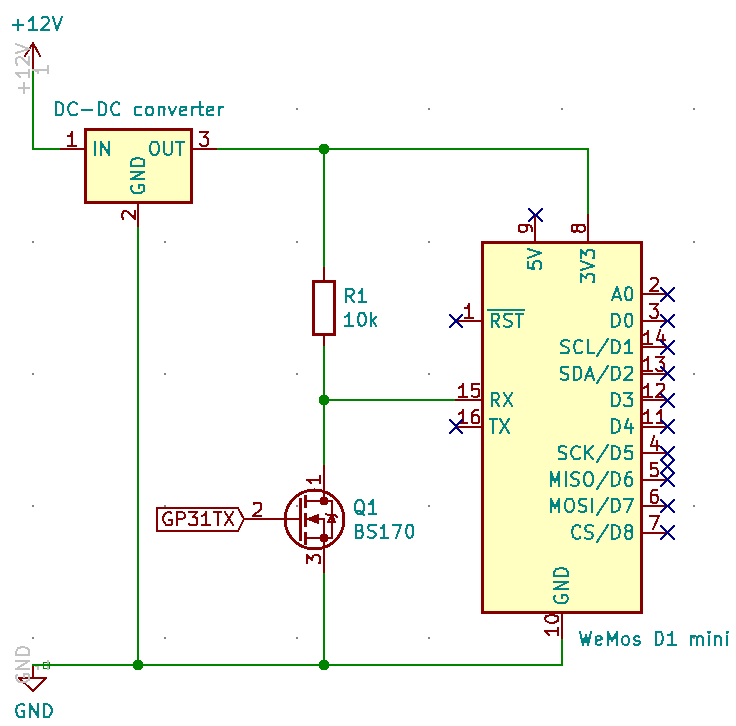

# Visualizing Sails Using a GPS Receiver, ESP8266 and OpenStreetMap
This repository contains code to visualize sails on a website. I use it to log my sails and to share them with friends and family.

The core of the setup is a GPS receiver which can emit [NMEA0183](https://en.wikipedia.org/wiki/NMEA_0183) sentences via RS232 for capture by an [ESP8266](https://en.wikipedia.org/wiki/ESP8266) wifi enabled microprocessor. The NMEA sentences are interpreted using the [NeoGPS library](https://github.com/SlashDevin/NeoGPS) yielding latitude, longitude, speed and heading which is continuously logged to the ESP8266 SPIFFS in a human readable CSV format. On a [WeMos D1 mini](https://docs.wemos.cc/en/latest/d1/d1_mini.html) board the SPIFFS has a capacity of 3 MB and can fit about 90.000 measurements corresponding to 2 days worth of sailing at an output frequency of every 2 seconds. The ESP8266 will continuously attempt to connect to the internet and upload whatever data it possesses. When data is successfully received then a push notification is sent to my phone via [Spontit](https://spontit.com/) to let me know that everything is working. Local data on the ESP8266 is only deleted if the md5 hash of the data on the ESP8266 matches the hash returned from the receiving end, ensuring that data is not lost. The sail can be visualized on a map provided by [OpenStreetMap](openstreetmap.org/) on a website. The website works especially well on a Smart TV for family events and the like.

With this setup in place the work flow is that i turn on the GPS receiver before I leave the pier, power it off when I get back and that's it. Data is automatically uploaded because the ESP8266 picks up the harbor WiFi as I return. Neat.

## What it looks like

_Figure 1. Visualization of a sail around [Middelgrundsfortet](https://en.wikipedia.org/wiki/Middelgrundsfortet). The track is color coded according to speed over ground._

_Figure 2. Junction box with WeMos D1 mini stuffed inside._

_Figure 3. ESP8266 website showing log files and allowing manual restart, removal and upload of log files. This works especially well on a smart phone._

## What's included
 1. Arduino sketch to program ESP8266
 2. Configuration files for NGINX and uwsgi
 3. Website to receive data from ESP8266 and visualize sails

Lines of the code containing the text "_Update this line_" require your attention. These lines contain configuration parameters such as your domain name, MD5 salt etc. You can find all these lines by issuing `grep -r "Update this line" ./`.

## Testing at home

It's very easy to test the system at home before you set it up _in situ_ without the hassle of setting up NGINX and uwsgi.

1. Install Python and `pip install flask`
2. Install Arduino and prerequisite packages
3. Configure `esp8266.ino` with proper WiFi credentials and IP address of the computer you'll use to run the flask server. Upload the code to the ESP8266.
4. Run `python webserver.py`
5. Submit NMEA sentences to the ESP8266 through the Arduino Serial Monitor.
   For example: `$GPRMC,225446,A,4916.45,N,12311.12,W,000.5,054.7,191194,020.3,E*68`
6. You can now see the data arriving in the command prompt and view it at http://127.0.0.1:8080. A sample data file is included.

## Prerequisites
### Hardware
 1. Sailboat with GPS receiver, my boat happened to be equipped with a [Furuno GP31](https://www.furunousa.com/en/support/gp31)
 2. ESP8266, in my case a [WeMos D1 mini](https://docs.wemos.cc/en/latest/d1/d1_mini.html)
 3. N-channel MOSFET, in my case a [BS170](https://www.onsemi.com/pub/Collateral/BS170-D.PDF)
 4. 10k resistor
 5. DC-DC converter to power the ESP8266 from 12V marine battery, in my case a board off of [eBay based on the LM2596S chip](https://www.ebay.com/sch/i.html?_nkw=LM2596S)

You'll probably also want a PCB to solder the parts onto and a box to put it in. You can find the schematic in Figure 4. All of these parts can be found on eBay.

_Figure 4. Schematic. GP31 TX wire is yellow. The BS170 MOSFET translates the RS232 level (-13V, 13V) into UART (3.3V, 0V). Current consumption from the 12V source is below 40 mA._

### Software
1. Web server to host visualization site and to receive data from the ESP8266.
    I've used NGINX and uwsgi to host a website using the [Flask framework](https://flask.palletsprojects.com/) on a Debian server in the [DigitalOcean](https://www.digitalocean.com/) cloud.
2. [Arduino](https://www.arduino.cc/en/Main/Software) with the following additional libraries to program the ESP8266:
    a) [ESP8266 library](https://github.com/esp8266/Arduino)
    b) [NeoGPS library](https://github.com/SlashDevin/NeoGPS)
